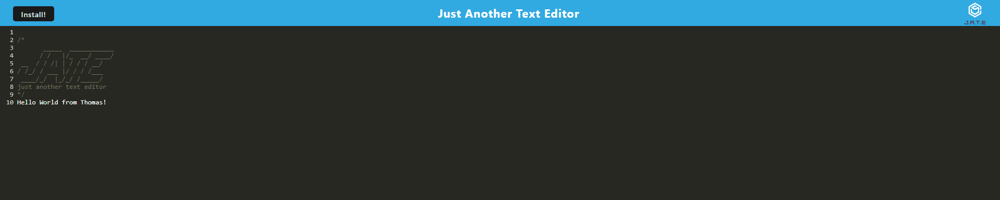

# Text-editor

## Description
This text editor serves as an installable development that works both online and offline. During this project I have gained a deeper understanding of progressive web development and it's interworkings of JavaScript and how filing/folder structure determines pathing of node modules.
## Usage
